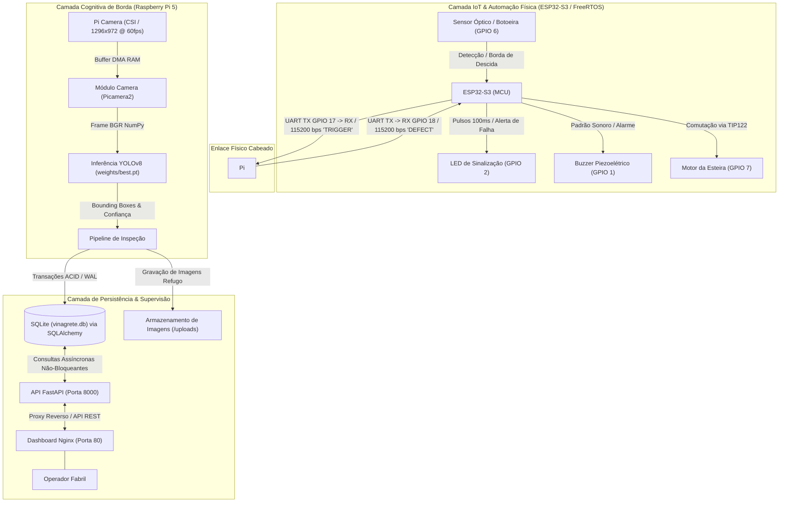

# Sistema Embarcado de Visão Computacional na Borda e IoT para Controle de Qualidade de Cartas TCG Pós-Corte

> **Trabalho de Conclusão de Capacitação (TCC) – PNAAT 2026**  
> **Turma A - Tarde | Juazeiro do Norte - CE**  
> **Equipe Vinagrete:** Elilúcio Teixeira, Icaro Cavalcante, Gabriel Souza e Samuel Jackson  
> **Tema Industrial:** Cenário 3 – Indústria de Bens de Consumo (Etapa de Embalagem e Expedição)  


---

## 📑 1. Visão Geral do Projeto

No setor de manufatura gráfica especializado na produção de **Cartas Colecionáveis** (*Trading Card Games* – TCG, como *Pokémon*), a etapa pós-corte (guilhotina mecânica e corte-e-vinco) é crítica. O desgaste contínuo de lâminas e oscilações no tracionamento das esteiras geram defeitos como:
- **Desalinhamento Geométrico (*Miscut*):** Corte assimétrico em relação às margens de impressão;
- **Deformações Estruturais:** Vincos e marcas de amassado causados por roletes mecânicos;
- **Desgaste de Bordas e Cantos:** Cantos mastigados ou esbranquiçados (*corner whitening*).

Em cartas colecionáveis, onde a integridade física e o alinhamento milimétrico determinam diretamente a conformidade e o valor comercial do produto, a ausência de inspeção visual automatizada resulta em devoluções onerosas, quebra de padrões estéticos e elevado custo com logística reversa.

Este projeto propõe uma **célula automatizada de controle de qualidade na borda (Edge AI) integrada a um controlador industrial (IoT)** instalada na saída da esteira de corte. O sistema realiza a captura sincronizada de imagem sob iluminação difusa, executa inferência visual via modelo de *Deep Learning* (MobileNet) para identificação de defeitos por caixas delimitadoras (*bounding boxes*), comanda respostas físicas com Background Subtraction em tempo real (parada de esteira e sinalização luminosa/acústica via ESP32-S3) e consolida a rastreabilidade fabril por meio de uma API REST desacoplada e *Dashboard* web para os operadores.

---

## 💡 2. Arquitetura da Solução

O sistema foi arquitetado adotando o **desacoplamento estrito entre a camada física determinística (IoT) e a camada cognitiva pesada (Edge AI)**, garantindo que o processamento intensivo de visão computacional não comprometa o tempo de resposta e a segurança da esteira.

### 🖧 2.1. Diagrama de Blocos Preliminar da Arquitetura



### 🔁 2.2. Fluxo Sequencial de Execução
1. **Passagem do Item:** A carta em transporte atinge o ponto focal da câmera e é interceptada pelo Background Subtraction, que para a esteira posicionando a carta em posição adequada para captura de imagem;
2. **Gatilho Determinístico:** O ESP32-S3 identifica o evento com tempo de resposta $< 5\text{ ms}$ (com *debounce* de $50\text{ ms}$) e envia a instrução `TRIGGER` via barramento serial UART cabeado;
3. **Captura em Memória:** A Raspberry Pi 5 realiza a captura instantânea via `Picamera2` direto do *buffer* DMA em RAM ($< 15\text{ ms}$);
4. **Inferência de IA:** O modelo Ultralytics YOLOv8/MobileNet processa a imagem em resolução padronizada e retorna a lista de caixas delimitadoras (*bounding boxes*), rótulos de classe e grau de confiança;
5. **Decisão e Resposta de Borda:**
   - **Produto Conforme:** Não são identificadas classes de defeito. O pipeline prossegue e o lote segue fluxo normal, acionando a esteira novamente até que seja detectada a próxima carta;
   - **Produto Defeituoso:** A Raspberry Pi 5 envia o sinal `DEFECT` via UART para o ESP32-S3, que aciona imediatamente o padrão de sinalização com pulsos no LED e Buzzer, e codifica o frame anotado;
6. **Persistência Estruturada:** Em caso de refugo, a imagem anotada é gravada em disco (`/uploads`) e os metadados (timestamp, confiança, classe, lote) são inseridos transacionalmente no SQLite via SQLAlchemy;
7. **Supervisão Contínua:** O servidor FastAPI e o *Dashboard* web executam de forma isolada, consultando os registros agregados e permitindo o monitoramento do lote pelo operador em tempo real sem afetar o ciclo de inspeção da esteira.

---

## ⚙️ 3. Topologia de Hardware e Conexões Físicas

A montagem experimental de bancada integra a placa microcontrolada ESP32-S3 e o computador de placa única Raspberry Pi 5 através de ligações ponto a ponto com referência lógica comum:

| Componente | Pino ESP32-S3 | Pino Raspberry Pi 5 | Função / Descrição |
| :--- | :--- | :--- | :--- |
| **Comunicação Serial (TX)** | `GPIO 17` | `GPIO 15` (RX / Pin 10) | Envio de comando de gatilho (`TRIGGER`) do ESP para a Pi |
| **Comunicação Serial (RX)** | `GPIO 18` | `GPIO 14` (TX / Pin 8) | Recebimento de alertas de inspeção (`DEFECT`) da Pi para o ESP |
| **Referência de Nível Lógico** | `GND` | `GND` (Pin 6 / 9 / 14) | Malha de terra compartilhada para estabilidade de sinal |
| **Acionamento do Motor** | `GPIO 7` | — | Sinal digital para base do transistor Darlington TIP122 (via 1 kΩ) |
| **Sensor de Presença / Botão** | `GPIO 6` | — | Entrada digital com pull-up interno (ativo em nível lógico BAIXO) |
| **LED Indicador de Status** | `GPIO 2` | — | Sinalização visual de defeito / acionamento (via 330 Ω) |
| **Buzzer Piezoelétrico** | `GPIO 1` | — | Sinalização acústica pulsada / alerta sonoro industrial |
| **Câmera Digital de Borda** | — | Conector CSI-2 | Câmera para captura em alta velocidade orientada ortogonalmente |

---

## </> 4. Estrutura do Repositório

```text
vinagrete-generico/
├── docs/                     # (a ser implementado) Documentação final do projeto 
│   ├── requisitos.md         # (exemplo) Documentação de requisitos do projeto    
├── backend/                  # Servidor REST FastAPI e Camada de Dados
│   ├── crud.py               # Operações de banco (Lotes, Defeitos, Métricas)
│   ├── database.py           # Conexão SQLite e sessão SQLAlchemy
│   ├── Dockerfile            # Containerização do serviço backend
│   ├── main.py               # Endpoints REST e publicação de estáticos
│   ├── models.py             # Modelos relacionais ORM (Lote, Defeito, SistemaEstado)
│   ├── requirements.txt      # Dependências exclusivas do backend
│   ├── schemas.py            # Esquemas de validação Pydantic
│   └── seed.py               # Script de carga inicial e dados de teste
├── frontend/                 # Interface Web do Operador
│   ├── Dockerfile            # Container Nginx para entrega da UI
│   ├── index.html            # Estrutura do Dashboard
│   ├── nginx.conf            # Configuração de proxy reverso e roteamento
│   ├── script.js             # Lógica de atualização periódica e gráficos
│   └── style.css             # Estilização visual industrial
├── inference/                # Pipeline de Visão Computacional e Comunicação Borda
│   ├── camera.py             # Driver otimizado Picamera2 com captura via DMA
│   ├── detector.py           # Wrapper de inferência Ultralytics YOLOv8
│   ├── pipeline.py           # Orquestração (Captura -> YOLO -> Anotação -> SQLite)
│   └── serial_handler.py     # Gerenciador de comunicação serial UART com ESP32-S3
├── motor/                    # Firmware de Automação em C (ESP-IDF / FreeRTOS)
│   ├── CMakeLists.txt        # Configuração de compilação do projeto ESP-IDF
│   └── main/
│       ├── CMakeLists.txt    # Registro dos componentes do firmware
│       └── main.c            # Tasks FreeRTOS (botoeira, sensor de esteira, UART RX/TX)
├── scripts/                  # Ferramentas auxiliares e benchmarks
│   └── benchmark_camera.py   # Script de aferição de latência da captura Picamera2
├── tests/                    # Suíte de testes unitários e de integração
│   ├── test_camera.py        # Validação de latência (< 25 ms) e integridade da câmera
│   └── test_inference.py     # Validação das estruturas de predição do detector
├── docker-compose.yml        # Orquestrador multi-serviço (Backend + Frontend)
├── requirements.txt          # Dependências globais do ambiente Python
└── weights.dvc               # Rastreamento de versão dos pesos da rede neural (DVC)
```

---

## 🚨 5. Dependências e Tecnologias Utilizadas

### 🤖🇦🇮 5.1. Inteligência Artificial e Visão Computacional (Raspberry Pi 5)
- **Ultralytics YOLOv8/MobileNet (`ultralytics>=8.0.0`):** Arquitetura convolucional de detecção de objetos por *bounding boxes*, selecionada pelo compromisso entre precisão (*mAP*) e baixa latência em CPUs ARM de borda;
- **OpenCV Headless (`opencv-python-headless>=4.8.0`):** Processamento matricial de imagens, conversão de espaços de cor e renderização de anotações;
- **Picamera2 (`python3-picamera2`):** Interface nativa do Raspberry Pi OS (libcamera) que opera em modo de vídeo contínuo em RAM, eliminando o *overhead* de reinicialização de sensor e atingindo latências de captura inferiores a $15\text{ ms}$;
- **NumPy (`numpy>=1.24.0`):** Operações vetorizadas de tensores;
- **DVC (`dvc>=3.0.0`):** Versionamento de artefatos binários e rastreamento dos pesos do modelo (`best.pt`).

### ⌯⌲ 5.2. Comunicação e Persistência
- **PySerial (`pyserial>=3.5`):** Comunicação serial assíncrona cabeada entre Raspberry Pi 5 e ESP32-S3;
- **SQLAlchemy (`sqlalchemy>=2.0.0`):** ORM (*Object-Relational Mapping*) para modelagem e transações com garantias ACID;
- **SQLite 3:** Banco de dados relacional embarcado local, operando com *Write-Ahead Logging* (WAL) para suportar leituras concorrentes e proteção contra perda de dados em desligamentos repentinos.

### 🗄️ 5.3. Backend, Interface e Infraestrutura
- **FastAPI (`fastapi>=0.100.0`):** Framework web assíncrono de alta performance para a disponibilização da API REST;
- **Uvicorn (`uvicorn[standard]>=0.22.0`):** Servidor ASGI assíncrono;
- **Docker & Docker Compose:** Isolamento de contêineres e orquestração dos serviços de backend e frontend web;
- **Nginx:** Servidor HTTP e proxy reverso para distribuição estática do painel web.

### 🏻 5.4. Firmware e Microcontrolador (ESP32-S3)
- **ESP-IDF v5.x / FreeRTOS:** Sistema operacional de tempo real com divisão preemptiva de tarefas (*tasks* independentes para *polling* de botão, leitura de sensor de esteira e escuta serial UART);
- **Drivers de Hardware:** `driver/gpio` e `driver/uart` nativos do ecossistema Espressif.

---

## 🧭 6. Guia de Instalação e Execução

O projeto foi estruturado para cumprir o princípio de reprodutibilidade técnica em ambiente limpo (*Clean Environment Test*).

### ➡️ 6.1. Pré-requisitos
- **Raspberry Pi 5** com Raspberry Pi OS (Bookworm, 64-bit);
- **Python 3.11+** com `python3-venv` instalado;
- **ESP-IDF v5.1+** (ou extensão Espressif no VS Code) configurado para gravação no ESP32-S3;
- **Docker & Docker Compose** (opcional, para inicialização em contêiner do painel gerencial).

---

### ➡️ 6.2. Passo a Passo: Borda e Visão (Raspberry Pi 5)

1. **Clonar o Repositório:**
   ```bash
   git clone https://github.com/Icaro-Cavalcante/vinagrete-generico.git
   cd vinagrete-generico
   ```

2. **Instalar Dependências do Sistema (Câmera Picamera2):**
   ```bash
   sudo apt update
   sudo apt install -y python3-picamera2 python3-venv
   ```

3. **Criar e Ativar Ambiente Virtual:**
   ```bash
   # Habilita o acesso aos pacotes de sistema para herdar a biblioteca picamera2
   python3 -m venv --system-site-packages venv
   source venv/bin/activate
   ```

4. **Instalar Dependências Python:**
   ```bash
   pip install --upgrade pip
   pip install -r requirements.txt
   ```

5. **Obter os Pesos do Modelo:**
   Certifique-se de que o arquivo de pesos treinado (`best.pt`) esteja presente no diretório `weights/best.pt` (ou execute `dvc pull` caso o armazenamento remoto DVC esteja configurado).

6. **Executar o Serviço de Inspeção em Linha:**
   ```bash
   # Inicia a escuta da porta serial e aguarda triggers do ESP32-S3
   python -m inference.serial_handler
   ```

---

### ➡️ 6.3. Passo a Passo: Firmware da Esteira (ESP32-S3)

1. **Navegar até o Diretório do Firmware:**
   ```bash
   cd motor
   ```

2. **Configurar o Alvo para o ESP32-S3:**
   ```bash
   idf.py set-target esp32s3
   ```

3. **Compilar e Gravar o Firmware:**
   ```bash
   idf.py build
   idf.py -p /dev/ttyUSB0 flash monitor
   ```
   *(Substitua `/dev/ttyUSB0` ou `COMx` pela porta serial onde o microcontrolador está conectado).*

---

### ➡️ 6.4. Passo a Passo: Backend e Dashboard Web

Você pode executar o backend e o painel de monitoramento de duas formas:

#### Opção A: Execução via Docker Compose (Recomendado)
Na raiz do repositório, execute:
```bash
docker compose up -d --build
```
- **Backend API:** Disponível em `http://localhost:8000/docs` (Swagger UI);
- **Dashboard Web:** Disponível em `http://localhost:80` (Interface do Operador).

#### Opção B: Execução Nativa em Python
1. Em um terminal dedicado (com o ambiente virtual ativo):
   ```bash
   cd backend
   pip install -r requirements.txt
   uvicorn main:app --host 0.0.0.0 --port 8000 --reload
   ```
2. Abra o arquivo `frontend/index.html` em seu navegador web (ou configure um servidor estático local).

---

### ➡️ 6.5. Execução de Testes e Validação de Desempenho

Para assegurar a conformidade funcional e o atendimento aos requisitos de baixa latência de borda:

```bash
# Executa a suíte de testes automatizados
pytest -v

# Executa o benchmark de latência do subsistema de câmera
python scripts/benchmark_camera.py
```

---

## 𓊂 7. Rastreabilidade com os Requisitos do Projeto

A implementação contida neste repositório atende diretamente aos requisitos formais homologados para o projeto:

| ID Requisito | Descrição Sintética | Implementação no Repositório |
| :--- | :--- | :--- |
| **RF-01** | Detecção de Presença e Emissão de Gatilho | `motor/main/main.c`: `sensor_task()` monitora borda de descida no pino e envia `TRIGGER\n` via UART |
| **RF-02 / RF-03** | Captura em RAM e Inferência YOLOv8 | `inference/camera.py` (Picamera2 via DMA) e `inference/detector.py` (Ultralytics YOLO) |
| **RF-05** | Comunicação Serial Bidirecional | `inference/serial_handler.py` e `motor/main/main.c` operando a 115200 bps |
| **RF-06 / RF-07** | Sinalização Física de Falha | `motor/main/main.c`: `uart_rx_task()` e rotina `sinalizar()` acionando LED e Buzzer |
| **RF-09** | Persistência Relacional de Defeitos | `backend/crud.py` e `backend/models.py`: gravação de defeitos, lotes e imagem no SQLite via SQLAlchemy |
| **RF-10 / RF-11** | API REST e Dashboard do Operador | `backend/main.py` (FastAPI) e `frontend/` (Dashboard com gráficos temporais e galeria de falhas) |
| **RNF-01 / RNF-02** | Latência Crítica e Determinismo | Latência de captura $< 25\text{ ms}$ validada em `tests/test_camera.py` e ciclo FreeRTOS não-bloqueante |

---

## 🧾 8. Licença e Autoria

Este projeto foi desenvolvido como requisito parcial de conclusão do **Programa Nacional de Aprendizado Acelerado em Tecnologia (PNAAT 2026)**.
