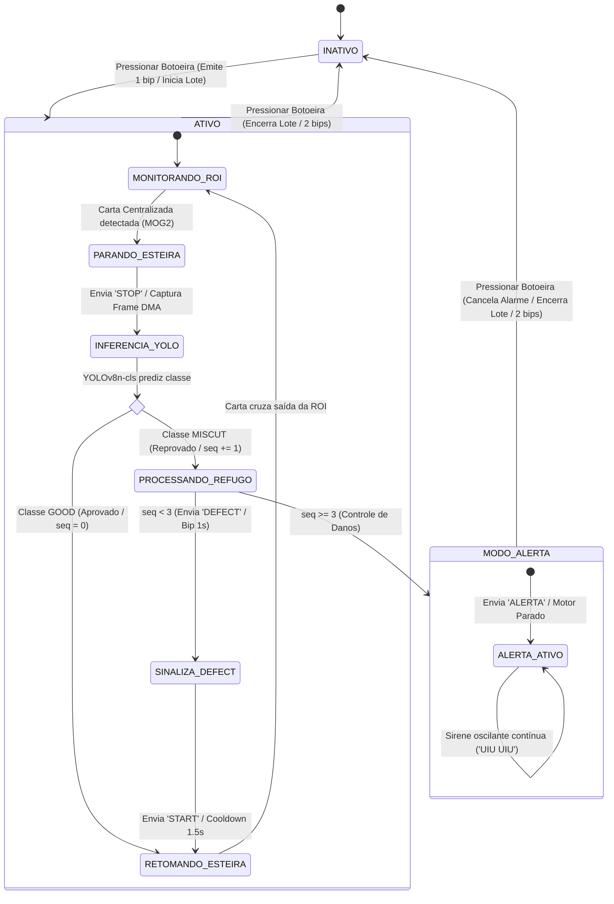

# Sistema Embarcado de Visão Computacional na Borda e IoT para Controle de Qualidade de Cartas TCG Pós-Corte

> **Trabalho de Conclusão de Capacitação (TCC) — PNAAT 2026**  
> **Turma A – Tarde | Juazeiro do Norte – CE**  
> **Equipe Vinagrete:** Elilúcio Teixeira · Icaro Cavalcante · Gabriel Souza · Samuel Jackson  
> **Tema Industrial:** Cenário 3 — Indústria de Bens de Consumo (Linha de Embalagem e Expedição)  

---

## 📑 Sumário do Manual
1. [Visão Geral e Contexto Industrial](#-1-visão-geral-e-contexto-industrial)
2. [Arquitetura da Solução e Diagramas Atualizados](#-2-arquitetura-da-solução-e-diagramas-atualizados)
3. [Componentes de Hardware e Especificações (BOM)](#-3-componentes-de-hardware-e-especificações-bom)
4. [Esquemático Elétrico e Instruções de Montagem](#-4-esquemático-elétrico-e-instruções-de-montagem)
5. [Estrutura Organizacional do Repositório](#-5-estrutura-organizacional-do-repositório)
6. [Guia de Instalação e Configuração Passo a Passo](#-6-guia-de-instalação-e-configuração-passo-a-passo)
7. [Procedimentos de Operação e Execução](#-7-procedimentos-de-operação-e-execução)
8. [Confirmação e Evidências de Execução Bem-Sucedida](#-9-confirmação-e-evidências-de-execução-bem-sucedida)

---

## 🏭 1. Visão Geral e Contexto Industrial

Na manufatura gráfica de alta precisão de **Cartas Colecionáveis (*Trading Card Games* — TCG, como *Pokémon*)**, a etapa pós-corte (guilhotina mecânica rotativa e corte-e-vinco) é suscetível a descalibrações dimensionais causadas por vibração mecânica e desgaste de facas. 

O principal defeito gerado é o **Miscut**: erro onde a carta é cortada fora de registro, quebrando a simetria das margens periféricas ou cortando a arte original e expondo a borda branca de impressão (*alignment dot*). No mercado de colecionáveis, onde empresas certificadoras (*PSA*, *BGS*, *CGC*) avaliam o alinhamento em notas de 1 a 10 e desvios submilimétricos derrubam o valor comercial em mais de 90%, **lotes inteiros de produtos lacrados são sumariamente recusados por lojistas e distribuidores**.

Este projeto implementa uma **célula automatizada de inspeção visual na borda (*Edge AI*) integrada a um controlador industrial determinístico (*IoT*)** instalada na saída da esteira de corte:
* **Detecção e Parada Sincronizada:** A câmera na Raspberry Pi 5 detecta a entrada do cartão via Subtração de Fundo (*Background Subtraction* MOG2) e comanda a frenagem da esteira via UART, eliminando qualquer borrão de movimento (*motion blur*);
* **Classificação Binária Especializada:** A rede neural **YOLOv8n-cls** classifica a carta estática em **`GOOD`** (Conforme) ou **`MISCUT`** (Defeituosa) com latência $< 25\text{ ms}$;
* **Atuação Eletromecânica e Alertas:** O microcontrolador **ESP32-S3 (FreeRTOS)** controla o motor DC da esteira, sinaliza defeitos pontuais (1 pulso de 1000 ms) e interrompe proativamente a linha fabril em caso de falhas sistemáticas repetitivas (**Controle de Danos**);
* **Rastreabilidade e Supervisão:** Registro transacional em banco relacional **SQLite (WAL)** com geração automática de lotes de produção e auditoria visual em tempo real via **API REST (FastAPI)** e **Dashboard Web (Nginx/Chart.js)**.

---

## 🖧 2. Arquitetura da Solução e Diagramas Atualizados

A solução adota **desacoplamento estrito** entre a camada física determinística de tempo real (IoT / MCU) e a camada cognitiva pesada de visão computacional (Edge AI / SBC).

Diagrama de Estados do Sistema



---

## 📦 3. Componentes de Hardware e Especificações (BOM)

| Item | Componente | Qtd. | Especificação / Modelo | Função no Sistema |
| :---: | :--- | :---: | :--- | :--- |
| **1** | Computador de Borda | 1 | **Raspberry Pi 5 (8 GB RAM)** | Orquestrador do pipeline, execução do YOLOv8 e backend. |
| **2** | Câmera Digital | 1 | **Raspberry Pi Camer Rev 1.3** | Captura via DMA sem jitter. |
| **3** | Microcontrolador | 1 | **ESP32-S3-WROOM-1 (Dual-Core, 16MB Flash)** | Controle determinístico do motor, botoeira e alarmes. |
| **4** | Atuador | 1 | **Motor da esteira** | Tração mecânica da transportadora de cartas. |
| **5** | Transistor de Potência | 1 | **TIP122 (Darlington NPN, TO-220)** | Chaveamento de potência do motor da esteira. |
| **6** | Diodo de Roda-Livre | 1 | **1N4007 (1A / 1000V)** | Proteção contra transientes indutivos do motor DC (*flyback*). |
| **7** | Resistor Base | 1 | **1 kΩ (1/4 W, 5%)** | Limitação de corrente entre GPIO 7 e a base do TIP122. |
| **8** | Resistor LED | 1 | **330 Ω (1/4 W, 5%)** | Limitação de corrente para o LED vermelho no GPIO 2. |
| **9** | Sinalizador Visual | 1 | **LED Difuso Vermelho 5 mm** | Sinalização óptica de status e detecção de falhas. |
| **10** | Sinalizador Sonoro | 1 | **Buzzer Ativo Piezoelétrico 5V** | Emissão de bips operacionais e sirene oscilante de alarme. |
| **11** | Entrada Manual | 1 | **Push-Button Tátil Industrial (4 pinos)** | Botoeira de comando do operador (ligar, desligar e desarmar). |
| **12** | Prototipagem | 2 | **Protoboard** | Montagem e distribuição dos barramentos elétricos. |
| **13** | Alimentação Externa | 1 | **Fonte DC 5V/12V (2A)** | Alimentação dedicada do motor DC (GND compartilhado). |
| **14** | Cabeamento | 12 | Jumpers Macho-Macho | Interconexão de sinais TTL, potência e malha de terra. |

---

## ⚡ 4. Esquemático Elétrico e Instruções de Montagem

### 4.1. Pinout e Mapeamento de Sinais
| Dispositivo / Periférico | Pino no ESP32-S3 | Pino na Raspberry Pi 5 | Nível Lógico / Polaridade | Função |
| :--- | :---: | :---: | :---: | :--- |
| **Buzzer Piezoelétrico** | `GPIO 1` | — | 3.3V / HIGH = Ativo | Alarme sonoro pulsado e sirene oscilante. |
| **LED Vermelho** | `GPIO 2` | — | 3.3V / HIGH = Aceso | Sinalização visual (via resistor de 330 Ω). |
| **Botoeira do Operador** | `GPIO 6` | — | Pull-up / LOW = Apertado | Chave manual liga/desliga com debounce de 50 ms. |
| **Base do TIP122 (Motor)**| `GPIO 7` | — | 3.3V / HIGH = Ligado | Comutação de potência da esteira (via 1 kΩ). |
| **Linha TX (UART)** | `GPIO 17` | `GPIO 15` (RX / Pin 10) | TTL 3.3V (115200 bps) | Envio de telemetria do ESP para a Pi (`SYS_ON`, etc). |
| **Linha RX (UART)** | `GPIO 18` | `GPIO 14` (TX / Pin 8) | TTL 3.3V (115200 bps) | Envio de ordens da Pi para o ESP (`STOP`, `DEFECT`). |
| **Malha de Terra Comum** | `GND` | `GND` (Pinos 6, 9 ou 14)| Referência 0V Comum | **Obrigatório:** Une terras da fonte, ESP32 e Pi. |

### 4.2. Diagrama de Montagem na Protoboard

```text
                  +5V / +12V (Fonte Externa do Motor)
                         │
                         ├───[ + Motor DC ]
                         │         │
                         │      [Motor] ────┐
                         │         │        │
                         │   ┌─────┴────┐   │
                         └───┤ 1N4007   ├───┤ (Diodo Flyback: Catodo com listra no +)
                             │ (Diodo)  │   │
                             └──────────┘   │
                                            │
                                         Coletor (C) - Pino Central
                                        ┌─────────┐
    GPIO 7 (ESP32) ─────[ 1 kΩ ]────────┤ TIP122  │ (Darlington NPN - TO-220)
                                        │ Base (B)│ Pino 1 (Esquerda)
                                        └────┬────┘
                                          Emissor (E) - Pino 3 (Direita)
                                             │
                                             ▼
                                     GND COMUM (Unir Fonte Externa + ESP32 + Pi 5)
    ─────────────────────────────────────────────────────────────────────────────
    GPIO 2 (ESP32) ─────[ 330 Ω ]────[ (+) LED (-) ]────────────────► GND COMUM
    
    GPIO 1 (ESP32) ──────────────────[ (+) Buzzer (-) ]─────────────► GND COMUM
    
    GPIO 6 (ESP32) ──────────────────[ Terminal 1 ] Botoeira
                                     [ Terminal 2 ]─────────────────► GND COMUM (Pull-up interno)

    GPIO 17 (ESP32 TX) ──────────────► GPIO 15 / Pin 10 (Pi 5 RX)
    GPIO 18 (ESP32 RX) ◄────────────── GPIO 14 / Pin 8  (Pi 5 TX)
```

### 4.3. Instruções Passo a Passo de Montagem Física
1. **Malha de Terra Comum:** Conecte o terminal negativo da fonte externa de alimentação do motor, o pino `GND` do ESP32-S3 e o pino `GND` (Pino 6 ou 14) da Raspberry Pi 5 no mesmo barramento azul de aterramento da protoboard.
2. **Circuito de Potência do Motor (TIP122):**
   * Posicione o transistor TIP122 na protoboard com a aleta metálica voltada para trás;
   * Conecte a **Base (Pino 1)** ao `GPIO 7` do ESP32 através de um resistor de **1 kΩ**;
   * Conecte o **Coletor (Pino 2)** ao polo negativo do motor da esteira;
   * Conecte o **Emissor (Pino 3)** diretamente ao `GND Comum`;
   * Instale o **diodo 1N4007 em antiparalelo** diretamente nos dois fios do motor: o catodo (faixa branca) no fio positivo (+) do motor e o anodo no fio negativo (-). *Atenção: A falta deste diodo danificará o transistor por transientes indutivos*.
3. **Sinalizadores Audiovisuais:**
   * Ligue o **Anodo (+)** do LED Vermelho ao `GPIO 2` através do resistor de **330 Ω**, e o Catodo (-) ao `GND`;
   * Ligue o terminal positivo (+) do Buzzer ao `GPIO 1`, e o negativo (-) ao `GND`.
4. **Botoeira de Controle:**
   * Ligue um dos terminais do push-button ao `GPIO 6` e o terminal oposto ao `GND`. O resistor de pull-up é acionado via software internamente no chip.
5. **Enlace Serial UART:**
   * Interligue `GPIO 17` (ESP32 TX) ao `GPIO 15` (Pi 5 RX) e `GPIO 18` (ESP32 RX) ao `GPIO 14` (Pi 5 TX). A interface opera nativamente em 3.3V sem necessidade de conversor de nível.

---

## 📂 5. Estrutura Organizacional do Repositório

```text
vinagrete-generico/
├── backend/                       # Camada de Dados e Servidor REST FastAPI
│   ├── crud.py                    # Operações de banco (Lotes, Defeitos, Métricas)
│   ├── database.py                # Conexão SQLite e configuração do engine WAL
│   ├── Dockerfile                 # Contêiner Docker do serviço Backend
│   ├── main.py                    # Endpoints REST e publicação de estáticos (/uploads)
│   ├── models.py                  # Modelos relacionais ORM (Lote, Defeito, SistemaEstado)
│   ├── requirements.txt           # Dependências isoladas do serviço backend
│   ├── schemas.py                 # Esquemas de validação Pydantic v2
│   └── seed.py                    # Script de carga inicial de desenvolvimento
├── docs/                          # Consolidação das especificações técnicas
│   ├── cenario.md                 # Contextualização do cenário escolhido e da solução
│   ├── model_train.py             # Script de treinamento do modelo com dataset no Roboflow
│   ├── modelo_ia.md               # Especificação técnica do treinamento da rede neural
│   ├── modelo_iot.md              # Especificação técnica da montagem do sistema embarcado
│   └── requisitos.md              # Especificação de requisitos do projeto
├── frontend/                      # Interface Web do Operador
│   ├── Dockerfile                 # Contêiner Nginx para distribuição estática
│   ├── index.html                 # Estrutura do Dashboard industrial responsivo
│   ├── nginx.conf                 # Configuração de proxy reverso e roteamento HTTP
│   ├── script.js                  # Lógica de polling assíncrono (2s) e gráficos Chart.js
│   └── style.css                  # Estilização visual industrial escura
├── inference/                     # Pipeline de Visão Computacional e Comunicação de Borda
│   ├── camera.py                  # Driver híbrido Picamera2 / GStreamer DMA forçando BGR
│   ├── detector.py                # Wrapper de inferência YOLOv8n-cls (PyTorch/Ultralytics)
│   ├── motion_detector.py         # Máquina de estados de visão e Background Subtraction MOG2
│   ├── pipeline.py                # Orquestrador: Captura -> Inferência -> Anotação -> SQLite
│   └── serial_handler.py          # Gerenciador da UART: ciclo de lotes, defeitos e ALERTA
├── motor/                         # Firmware em C (ESP-IDF v5.1+ / FreeRTOS)
│   ├── CMakeLists.txt             # Configuração de compilação do ESP-IDF
│   └── main/
│       ├── CMakeLists.txt         # Registro de componentes do firmware
│       └── main.c                 # Tasks: botoeira (50ms), UART assíncrona, alerta oscilante
├── scripts/                       # Ferramentas auxiliares e de diagnóstico
│   └── benchmark_camera.py        # Benchmark de latência real de captura (< 25 ms)
├── tests/                         # Suíte de testes unitários e de integração
│   ├── serial_conn.py             # Script de teste e monitoramento serial bruto
│   ├── test_camera.py             # Validação automatizada de latência e integridade de frame
│   ├── test_inference.py          # Validação das estruturas de predição do modelo YOLO
│   └── test_motion_detector.py    # Teste do ciclo de vida e transições da máquina de estados MOG2
├── config.py                      # Configurações globais (portas, limiares, ROI, alerta)
├── docker-compose.yml             # Orquestrador multi-serviço (Backend + Frontend)
├── Dockerfile.backend             # Imagem de build do backend para o Compose
├── Dockerfile.inference           # Imagem de inferência containerizada na Raspberry Pi 5
├── requirements.txt               # Dependências Python consolidadas
└── weights.dvc                    # Rastreamento de versão dos pesos da rede neural (DVC)
```

---

## 🛠️ 6. Guia de Instalação e Configuração Passo a Passo

### 6.1. Pré-requisitos
* **Raspberry Pi 5** executando **Raspberry Pi OS (Bookworm, 64-bit)**;
* **Python 3.11+** com `python3-venv` e `python3-picamera2` instalados via repositório APT nativo;
* **ESP-IDF v5.5** (ou extensão Espressif no VS Code) configurado no ambiente;
* **Docker & Docker Compose** (para execução em contêineres do backend e frontend).

### 6.2. Clonar o Repositório e Configurar Variáveis
```bash
git clone https://github.com/Icaro-Cavalcante/vinagrete-generico.git
cd vinagrete-generico
```

O arquivo `config.py` centraliza todos os parâmetros do sistema operacional de visão e automação. Principais parâmetros ajustáveis via variáveis de ambiente:
```python
# config.py
SERIAL_PORT = os.getenv("SERIAL_PORT", "/dev/ttyUSB0") # Ou /dev/ttyAMA0 para pinos GPIO nativos
BAUD_RATE = int(os.getenv("BAUD_RATE", 115200))
MODEL_PATH = os.getenv("MODEL_PATH", "weights/best.pt")
CONF_THRESHOLD = float(os.getenv("CONF_THRESHOLD", "0.5"))
CONSECUTIVE_DEFECTS_ALERT = int(os.getenv("CONSECUTIVE_DEFECTS_ALERT", "3")) # Limiar de ALERTA
ROI_X_BOUNDS = (450, 900)  # Faixa central da esteira em câmera 1296x972
ROI_Y_BOUNDS = (0, 972)
```

### 6.3. Compilação e Gravação do Firmware no ESP32-S3
Conecte o ESP32-S3 ao computador via cabo USB:
```bash
cd motor

# 1. Definir o microcontrolador alvo
idf.py set-target esp32s3

# 2. Compilar o projeto FreeRTOS
idf.py build

# 3. Gravar na placa e abrir o monitor serial (ajuste a porta serial)
idf.py -p /dev/ttyUSB0 flash monitor   # Linux
idf.py -p COM "número da porta"        # Windows
```
*(Pressione `Ctrl + ]` para fechar o monitor serial após validar a inicialização).*

### 6.4. Configuração do Ambiente de Visão (Raspberry Pi 5)
```bash
# 1. Instalar dependências de sistema da câmera e venv
sudo apt update
sudo apt install -y python3-picamera2 python3-venv libcamera-dev

# 2. Criar ambiente virtual herdando as bibliotecas do sistema
python3 -m venv --system-site-packages venv
source venv/bin/activate

# 3. Instalar bibliotecas de visão e IA
pip install --upgrade pip
pip install -r requirements.txt

# 4. Baixar/garantir os pesos treinados no diretório weights/
# Certifique-se de que o arquivo weights/best.pt está presente no projeto
```

### 6.5. Inicialização da Camada de Supervisão (Backend e Frontend)

Na raiz do projeto:
```bash
docker compose up -d --build
```
* **Dashboard Web:** `http://localhost:80`
* **Documentação Swagger (API):** `http://localhost:8000/docs`

---

## 🚀 7. Procedimentos de Operação e Execução

### 7.1. Inicialização do Serviço de Inspeção em Linha
Com o backend ativo e o ESP32 gravado e interligado, execute na Raspberry Pi:
```bash
source venv/bin/activate
python -m inference.serial_handler
```
O console exibirá:
```text
[SERVIÇO] Iniciando barramento Serial na porta /dev/ttyUSB0...
[SERVIÇO] Sistema pronto. Aguardando comando SYS_ON do ESP32-S3...
```

### 7.2. Operação Passo a Passo na Bancada
1. **Ligar o Sistema (Partida do Turno):**
   * Pressione a **botoeira física** do ESP32;
   * O ESP32 emite **1 pulso curto ($500\text{ ms}$)** no LED e Buzzer, aciona o motor da esteira e envia `SYS_ON\n`;
   * A Raspberry Pi abre automaticamente um **novo lote autoincremental no SQLite** e ativa o monitoramento contínuo da ROI.
2. **Fluxo de Inspeção de Cartas:**
   * Insira cartas individualmente na esteira em movimento;
   * Ao atingir a faixa central da ROI, o algoritmo MOG2 detecta a carta e envia `STOP\n`;
   * O motor para silenciosamente, a Picamera2 captura o frame em RAM ($< 15\text{ ms}$) e o YOLOv8n-cls executa a inferência:
     * **Carta Conforme (`GOOD`):** O motor é religado silenciosamente via `START\n`, a carta é ejetada e o lote tem seu contador de peças boas incrementado (sem gravação de foto);
     * **Carta Defeituosa (`MISCUT`):** O ESP32 emite **1 pulso longo ($1000\text{ ms}$)** no LED e Buzzer, a foto anotada é salva em `/uploads`, a falha é registrada no banco e a esteira é retomada após $1.2\text{ s}$ de cooldown.
3. **Disparo do Modo ALERTA (Controle de Danos):**
   * Se forem detectadas **3 cartas consecutivas com defeito**, o sistema despacha `ALERTA\n`;
   * A esteira é **permanentemente paralisada** e o ESP32 entra em modo de alarme oscilante contínuo ($500\text{ ms}$ ON / $500\text{ ms}$ OFF tipo sirene "UIU-UIU-UIU");
   * O pipeline de visão congela novas inspeções.
4. **Desarme do Alarme e Desligamento (Parada do Turno):**
   * O operador pressiona a **botoeira física**;
   * O sistema cessa o alarme imediatamente, emite **2 pulsos curtos ($500\text{ ms}$)** de confirmação, desliga o motor e envia `SYS_OFF\n`;
   * A Raspberry Pi **encerra o lote no banco de dados**, gravando o timestamp final.

---


## ✅ 8. Confirmação e Evidências de Execução Bem-Sucedida

A correta execução de todas as etapas pode ser auditada através das seguintes evidências:

1. **Dashboard Web Operacional:** Acesse `http://localhost:80`. O painel deve exibir os cartões com:
   * Status do Sistema: `ATIVO` (quando ligado);
   * Identificador do Lote: `Lote #X`;
   * Total de Cartas e Total de Defeitos sincronizados;
   * Gráfico de barras temporais por horário;
   * Galeria exibindo os cortes refugados com bounding box e grau de confiança.
2. **Documentação Interativa da API (Swagger UI):** Acesse `http://localhost:8000/docs`. Todos os endpoints (`/api/inspecao`, `/api/lote`, `/api/dashboard-summary`) devem responder com código HTTP `200 OK`.
3. **Auditoria Transacional no SQLite:**
   ```bash
   sqlite3 data/vinagrete.db "SELECT id, status, cartas_totais, cartas_defeituosas FROM lotes ORDER BY id DESC LIMIT 3;"
   sqlite3 data/vinagrete.db "SELECT id, id_lote, tipo_defeito, grau_confiabilidade, timestamp FROM defeitos ORDER BY id DESC LIMIT 5;"
   ```
4. **Pasta de Imagens de Auditoria:**
   Verifique se as fotos dos refugos estão sendo gravadas com sucesso no diretório montado:
   ```bash
   ls -la data/uploads/
   ```

## 👥 9. Integrantes

| Contribuidores 🧑‍🎓  | Funções 🚀 |
| ------------- | ------------- |
| [Icaro Cavalcante](https://github.com/Icaro-Cavalcante)  | Desenvolvedor  |
| [Elilúcio Teixeira](https://github.com/Elilucio7) | Desenvolvedor  |
| [Gabriel Souza](https://github.com/gabriel-souza-santos) | Desenvolvedor |
| [Samuel Jackson](https://github.com/SJacksonML) | Desenvolvedor  |
